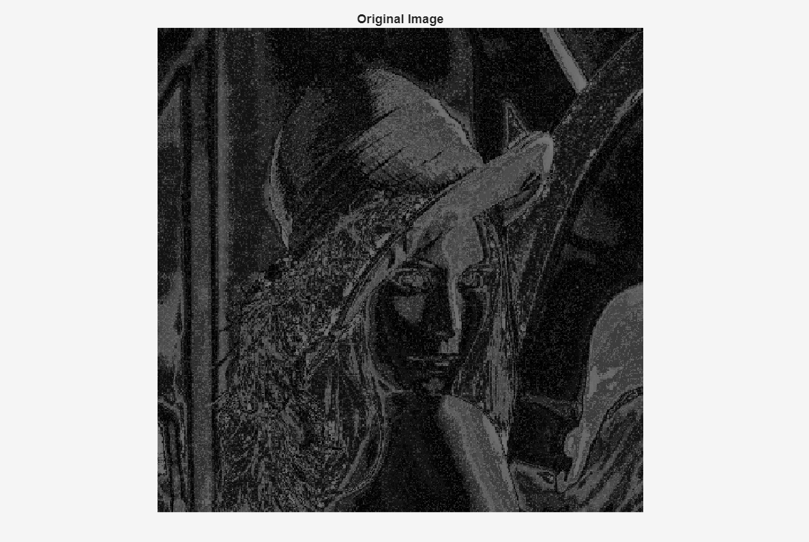
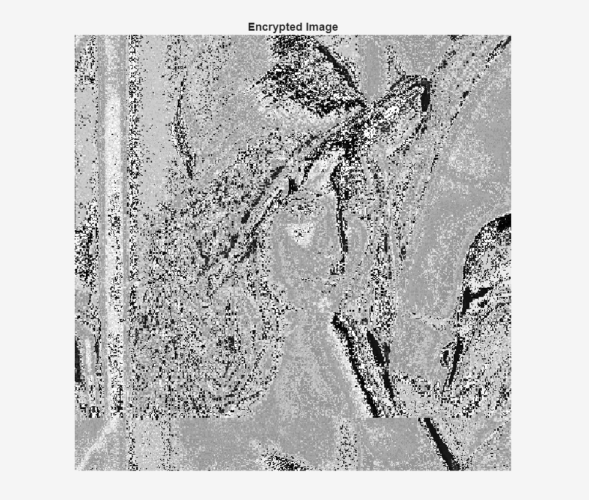
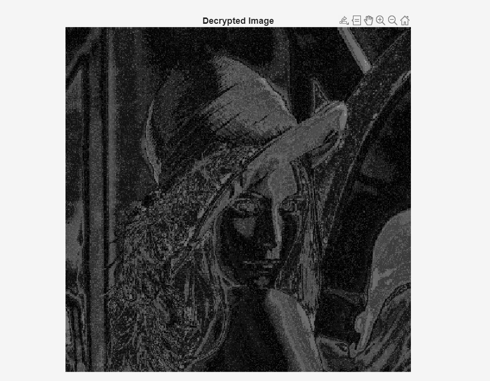
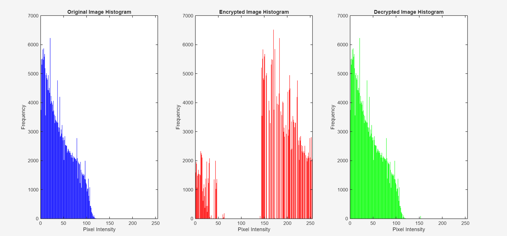

# 🔐 Hyperchaotic Image Encryption and Decryption using MATLAB

This repository contains a complete implementation of a grayscale image encryption scheme using:

- 🌀 Hyperchaotic systems
- 🧬 Quantum-inspired dynamic S-Boxes
- 🔁 Multi-stage XOR diffusion and permutation

---

## 🖼️ Example Output

### ✅ Original Image

### 🔒 Encrypted Image

### 🔓 Decrypted Image

### 📊 Histogram Analysis

---

## 🚀 Features

- **Chaotic Key Generation:** Uses a 4D hyperchaotic system for high sensitivity and unpredictability.
- **Dynamic S-Box:** Generated per encryption session from chaotic sequence.
- **Bitwise Scrambling:** XOR-based image scrambling for entropy boost.
- **Multi-Round Diffusion:** Strong confusion/diffusion using multiple keys.
- **Perfect Reversibility:** Image can be decrypted without loss using saved seeds.

---

## 📁 File Structure

📂 Project Root
├── Original_Image.png # Original grayscale image
├── Encrypted_Image.png # Encrypted output
├── Decrypted_Image.png # Reconstructed image
├── Histogram_Analysis.png # Comparison of histograms
├── Hyperchatio_Image_Encryption... # MATLAB source code (.m)
├── README.md # This file

---

## 📈 Security Evaluation

| Metric                                 | Value       |
| -------------------------------------- | ----------- |
| 🔹 Correlation (Original vs Encrypted) | ~ near 0    |
| 🔹 Correlation (Original vs Decrypted) | ~ near 1    |
| 🔹 Chi-square Test (Encrypted)         | High (good) |
| 🔹 Histogram Intersection              | Close to 1  |

> These results show **strong encryption** and **accurate decryption**.

---

## 🧪 Requirements

- MATLAB R2019b or newer
- Image Processing Toolbox

---

## 🧠 Applications

- Secure image transmission
- IoT visual data protection
- Cloud-based image security
- Lightweight image encryption systems
  
---

## ✍️ Author

Developed with MATLAB and chaos theory 🌀 by **Soham Raskar, Tasmay Shah, Iram Shaikh**

Feel free to open an issue or contribute to the repository!
